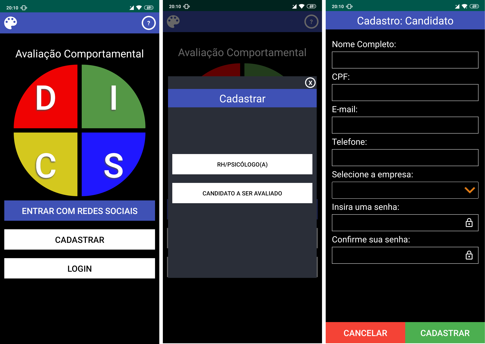

# Disc APP

This project is a behavioral assessment APP called DISC, it was developed for the TCC of the Technical course in Systems Development at ETEC Irmã Agostina.



## Installation

- [Upload the API that is in that repository](https://github.com/carlosfloresta/Webservice-DISC).

```bash
Replace "link API" from this project, with the link where you placed the repository API.
```

## Usage

```bash
Android studio emulator or Similar
```


## License
- You can use the code for study.
- You may not use it for commercial purposes, subject to penalties under local law.
